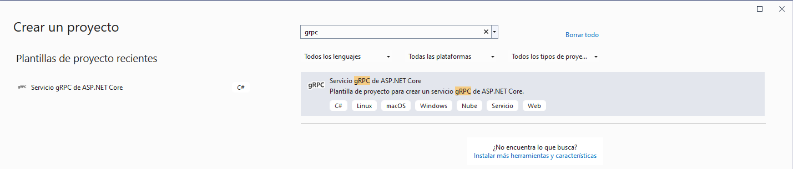
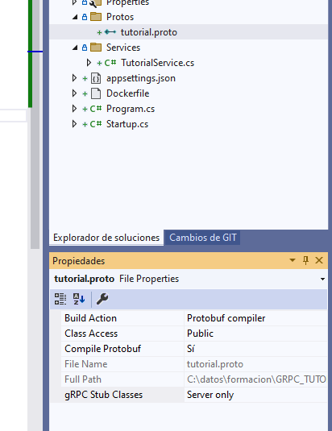

# grpc-tutorial
Tutorial on how to create a grpc .net service and consume it from vue js

## STEPS

### Service
- create new vs project from grpc template  
  
- add new .proto file
- set file properties to compile:  

- Include NuGet package Grpc.AspNetCore.Web:
```
NuGet\Install-Package Grpc.AspNetCore.Web -Version 2.49.0
```
- Modify Startup.cs, to allow vue client reach service (CORS, and GRPC communication).

```
public class Startup
{
	// This method gets called by the runtime. Use this method to add services to the container.
	// For more information on how to configure your application, visit https://go.microsoft.com/fwlink/?LinkID=398940
	public void ConfigureServices(IServiceCollection services)
	{
		services.AddGrpc();

		//Add cors
		services.AddCors(o => o.AddPolicy("AllowAll", builder =>
		{
			builder.AllowAnyOrigin()
				   .AllowAnyMethod()
				   .AllowAnyHeader()
				   .WithExposedHeaders("Grpc-Status", "Grpc-Message", "Grpc-Encoding", "Grpc-Accept-Encoding");
		}));
	}

	// This method gets called by the runtime. Use this method to configure the HTTP request pipeline.
	public void Configure(IApplicationBuilder app, IWebHostEnvironment env)
	{
		if (env.IsDevelopment())
		{
			app.UseDeveloperExceptionPage();
		}

		app.UseRouting();

		//Add GrpcWeb
		app.UseGrpcWeb();

		//Add cors
		app.UseCors("AllowAll");

		app.UseEndpoints(endpoints =>
		{
			//before:
			//endpoints.MapGrpcService<TutorialService>();
			
			//after:
			endpoints.MapGrpcService<GreeterService>().EnableGrpcWeb()
				.RequireCors(cors => cors.AllowAnyHeader().AllowAnyMethod().AllowAnyOrigin());

			endpoints.MapGet("/", async context =>
			{
				await context.Response.WriteAsync("Communication with gRPC endpoints must be made through a gRPC client. To learn how to create a client, visit: https://go.microsoft.com/fwlink/?linkid=2086909");
			});
		});
	}
}
```
- Another option is to set up a proxy for docker (Envoy proxy): 
  - https://www.envoyproxy.io/
  - https://github.com/grpc/grpc-web/tree/master/net/grpc/gateway/examples/helloworld#configure-the-proxy

- add httpPort and sslPort to launchSettings.json file, to set fixed values:
```
{
  "profiles": {
    "GrpcTutorial": {
      "commandName": "Project",
      "environmentVariables": {
        "ASPNETCORE_ENVIRONMENT": "Development"
      },
      "applicationUrl": "https://localhost:5001"
    },
    "Docker": {
      "commandName": "Docker",
      "launchUrl": "{Scheme}://{ServiceHost}:{ServicePort}",
      "publishAllPorts": true,
      "httpPort": 51804,
      "useSSL": true,
      "sslPort": 44361
    }
  }
}
```


### Client


### VUE 3

#### Init Vue project
- npm init vue@latest (in powershell or cmd, not in Git Bash)
- cd vue-grpc
- npm install
- npm run lint
- npm run dev

#### Problem --> it seems that for now (2022/11/02) the file generated by protoc is not compatible with the import system of Vue 3.


#### VUE 2
- npm install -g @vue/cli
- put vue path in environment variables, or run:
```  
C:\Users\user.name\AppData\Roaming\npm\vue create vue-grpc
```

### how to install proto
https://www.geeksforgeeks.org/how-to-install-protocol-buffers-on-windows/

1.- download version: 
https://github.com/protocolbuffers/protobuf/releases
2.- paste protoc-21.5-win64 in C:\.
3.- add C:\protoc-21.5-win64-win64 to the system variable Path
4.- $ protoc --version
	libprotoc 3.21.5
5.- download https://github.com/grpc/grpc-web/releases
6.- add to the system variable Path: C:\protoc-web-client (protoc-gen-grpc-web-1.3.1-windows-x86_64.exe)


## add dependencies to package.json
```
"google-protobuf": "^3.21.2",
"grpc-web": "^1.3.1",
```

## generate protos
- copy the proto file into vue project
- excecute command: 
```
protoc src/protos/tutorial.proto --js_out=import_style=commonjs:./ --grpc-web_out=import_style=commonjs,mode=grpcwebtext:./

```


## Documentation
### GRPC Service  
- https://docs.microsoft.com/es-es/aspnet/core/tutorials/grpc/grpc-start?view=aspnetcore-3.0&tabs=visual-studio
- https://medium.com/@lukastosic/part-3-grpc-its-fairly-simple-tips-and-tricks-c7017ed9735e
- https://docs.microsoft.com/en-us/visualstudio/containers/container-launch-settings?view=vs-2019

### Vue client  
- https://cli.vuejs.org/guide/creating-a-project.html
- https://www.geeksforgeeks.org/how-to-install-protocol-buffers-on-windows/
- https://medium.com/@aravindhanjay/a-todo-app-using-grpc-web-and-vue-js-4e0c18461a3e
- https://abhinandanaryal.info.np/article/a-complete-walk-through-of-using-grpc-web-using-net-core-server-and-vuejs-client